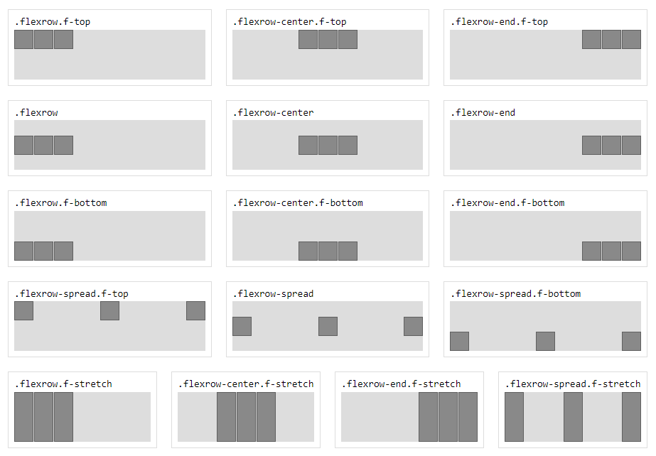
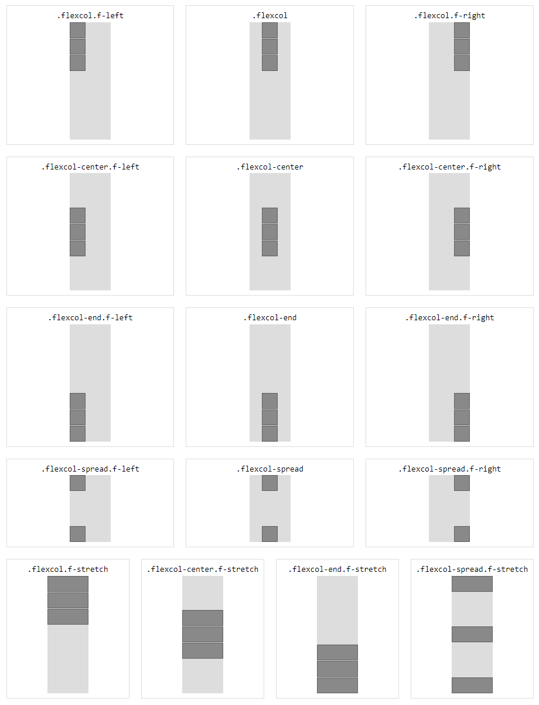

[](https://opensource.org/licenses/MIT)

my-css-flex
===========
The CSS flex classnames every project needs.

## Install
```sh
npm install my-css-flex
```

```html
<link rel="stylesheet" href="node_modules/css-flex/flex.min.css" />
```

or a CDN Link:
```html
<link rel="stylesheet" href="https://cdn.jsdelivr.net/gh/taitulism/css-flex@latest/flex.min.css" />
```


Classnames
----------
>Reference Images: [Rows](#rows) | [Columns](#columns)

### Row Classnames:
Main axis (`x`)
* `.flexrow`
* `.flexrow-start` (alias: `.flexrow`)
* `.flexrow-center` (alias: `.flex-center`)
* `.flexrow-end`
* `.flexrow-spread`

Secondary axis (`y`)
* `.f-top`
* `.f-bottom`
* `.f-stretch`


### Column Classnames:
Main axis (`y`)
* `.flexcol`
* `.flexcol-start` (alias: `.flexcol`)
* `.flexcol-center`
* `.flexcol-end`
* `.flexcol-spread`

Secondary axis (`x`)
* `.f-left`
* `.f-right`
* `.f-stretch`

### Flex item
* `.flex-item`

&nbsp;

A few words
-----------
>### TL;DR
>With `my-css-flex` - flex containers are centered on the secondary axis by default because it makes more sense IMHO.

<details>
	<summary>Read More...</summary>
Flex containers have a main axis and a secondary axis. The main axis is the one that matches the container direction (`x` for rows, `y` for columns). The secondary axis is, of course, the other one.

To align items inside a flex container on its main axis we use the `justify-content` CSS property and for the secondary axis we use `align-items`.

Naturally, flex items will be placed at the top-left corner, for both rows and columns. This is because the default value for both axes is `flex-start`.

While it makes sense for the main axis, it makes less sense for the secondary axis.

When we close our eyes and imagine a navigation bar (or any other row of buttons) we would probably picture it centered on the `y` axis with equal space at the top and at the bottom.

With `my-css-flex` - package flex containers are **centered on the secondary axis by default**.
</details>

&nbsp;

------------------------------------------------------------

Flex Direction
--------------
There are two main classnames, one for rows and one for columns: 
* `.flexrow`
* `.flexcol`

&nbsp;

Main Axis
---------
To place the items along the main axis use `flexrow` | `flexcol` with, optionally, one of the following suffixes:  
```
-start | -center | -end | -spread
```
>* `-start` is the default for the main axis and can be omitted:  
>`.flexrow` and `.flexrow-start` are the same.  
`.flexcol` and `.flexcol-start` are the same.  

&nbsp;

`.flexrow`
```
┌──────────────────┐
│ ┌──┐┌──┐         │
│ └──┘└──┘         │
└──────────────────┘
```
&nbsp;

`.flexrow-center`
```
┌──────────────────┐
│     ┌──┐┌──┐     │
│     └──┘└──┘     │
└──────────────────┘
```
&nbsp;

`.flexrow-end`
```
┌──────────────────┐
│         ┌──┐┌──┐ │
│         └──┘└──┘ │
└──────────────────┘
```
&nbsp;

`.flexrow-spread` (A.K.A "space-between")
```
┌──────────────────┐
│ ┌──┐        ┌──┐ │
│ └──┘        └──┘ │
└──────────────────┘
```

> To see the `flexcol` equivalents, please tilt your head to the left :)

&nbsp;

Secondary Axis
--------------
To align items along the secondary axis we add a secodary classname.

Secondary classnames start with an `f-` prefix and should be used together with a main axis classname.

For rows:
* `.f-top`
* `.f-bottom`

For columns:
* `.f-left`
* `.f-right`

For both, rows and columns:
* `.f-stretch`

&nbsp;

> The "`f-`" prefix is used to reduce the chance of classname collisions.

&nbsp;

Examples:

`.flexrow-center.f-top`
```
┌─────────────────────┐
│      ┌──┐ ┌──┐      │
│      └──┘ └──┘      │
│                     │
│                     │
└─────────────────────┘
```
&nbsp;

`.flexrow-center.f-stretch`
```
┌─────────────────────┐
│      ┌──┐ ┌──┐      │
│      │  │ │  │      │
│      │  │ │  │      │
│      └──┘ └──┘      │
└─────────────────────┘
```
&nbsp;

`.flexcol-spread.f-right`
```
┌────────────┐
│       ┌──┐ │
│       └──┘ │
│            │
│            │
│       ┌──┐ │
│       └──┘ │
└────────────┘
```

&nbsp;

Centering
---------
To center a single item inside a container use (on the container):
* `.flex-center`
```
┌─────────────┐
│             │
│     ┌─┐     │
│     └─┘     │
│             │
└─────────────┘
```

For multiple items use one of:
* `.flexrow-center`
* `.flexcol-center`

```
.flexrow-center            .flexcol-center
┌──────────────┐             ┌───────────┐
│              │             │           │
│              │             │    ┌─┐    │
│    ┌─┐┌─┐    │             │    └─┘    │
│    └─┘└─┘    │             │    ┌─┐    │
│              │             │    └─┘    │
│              │             │           │
└──────────────┘             └───────────┘
```

> In any case, don't use a secondary axis classname.

&nbsp;

Flex item
---------
```css
.flex-item
```  
Sets a flex item with `flex: 1 1 auto;`

Common usages:
1. When all the items in a flex container have the same size and expected to grow/shrink similarly.
	```
	┌────────────────┐    ┌────────────────────────┐
	│┌──┐┌──┐┌──┐┌──┐│ ←→ │┌────┐┌────┐┌────┐┌────┐│
	│└──┘└──┘└──┘└──┘│    │└────┘└────┘└────┘└────┘│
	└────────────────┘    └────────────────────────┘
	```
2. When you need one item in a flex container to be stretchy/greedy and take all the space it could get while the rest of its siblings have static sizes.
	```
	┌──────────────────────────┐
	│┌──┐┌──┐┌──┐┌────────┐┌──┐│
	│└──┘└──┘└──┘└────────┘└──┘│
	└──────────────────────────┘
	```

&nbsp;

&nbsp;

# Reference Images
## Rows 


## Columns


&nbsp;


Development
===========

Open the playground HTML file in the browser
```
./playground/index.html
```

To work with the minified file, run:
```sh
npm run dev
```
and swap CSS references in the playground HTML

Publish
-------
Currently there are no tests.

Before publish run the HTML playground to verify everything visually.

> Todo: Tests
