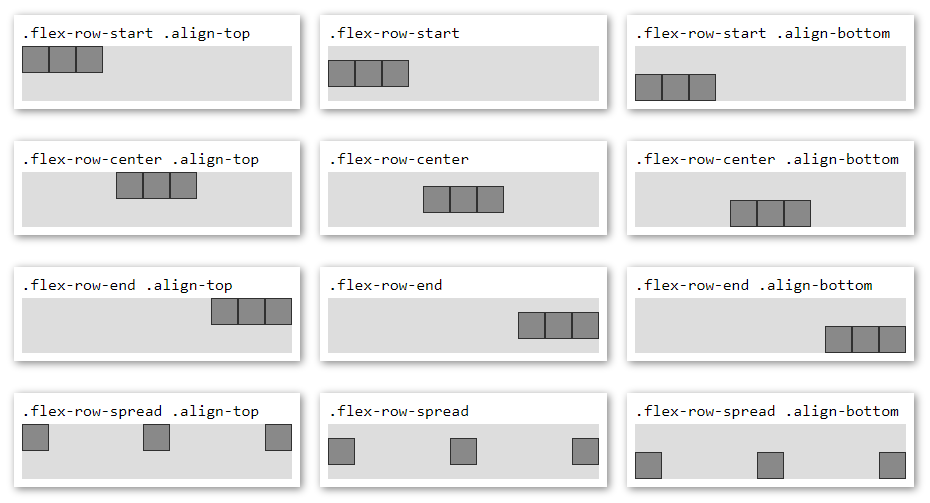
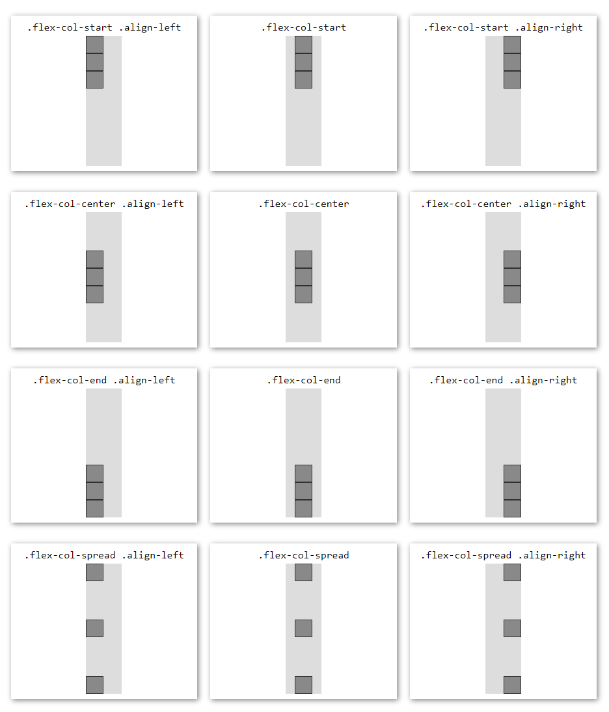

css.flex
========
The CSS flex classnames every project needs.

## Install
```sh
npm install css.flex
```

```html
<link rel="stylesheet" href="node_modules/css-flex/flex.min.css" />
```

CDN Link:
```html
<link rel="stylesheet" href="https://cdn.jsdelivr.net/gh/taitulism/css-flex@latest/flex.min.css" />
```


Classnames
----------
### **Row**
[See a reference image](#rows)

#### Main axis (`x`) classnames:
* `.flex-row-start` (alias: `.flex-row`)
* `.flex-row-center` (alias: `.flex-center`)
* `.flex-row-end`
* `.flex-row-spread`

#### Secondary axis (`y`) classnames:
* `.align-top`
* `.align-bottom`

&nbsp;

### **Column**
[See a reference image](#columns)

#### Main axis (`y`) classnames:
* `.flex-col-start` (alias: `.flex-col`)
* `.flex-col-center`
* `.flex-col-end`
* `.flex-col-spread`

#### Secondary axis (`x`) classnames:
* `.align-left`
* `.align-right`

&nbsp;

### **Flex item**
* `.flex-item`

&nbsp;


Beahvior
--------
> **NOTE:** Everything in these docs is true for both rows and columns.

Naturally, flex items will be placed at the top-left corner.

For example, a row:
```
┌──────────────────┐
│ ┌───┐ ┌───┐      │
│ │   │ │   │      │
│ └───┘ └───┘      │  display: flex;
│                  │  flex-direction: row;
│                  │
└──────────────────┘
```
Well, this shouldn't be the default beahvior IMHO, the items should be centered on the secondary axis by default (in this case - on the `y` axis), like this:
```
┌──────────────────┐
│                  │
│ ┌───┐ ┌───┐      │
│ │   │ │   │      │ .flex-row
│ └───┘ └───┘      │
│                  │
└──────────────────┘
```
It just makes more sense to me and that's what I need most of the time.

The same goes for columns:
```
display: flex;
flex-direction: column;       .flex-col
┌──────────┐                  ┌──────────┐
│ ┌──┐     │                  │   ┌──┐   │
│ └──┘     │                  │   └──┘   │
│ ┌──┐     │        vs.       │   ┌──┐   │
│ └──┘     │                  │   └──┘   │
│          │                  │          │
│          │                  │          │
└──────────┘                  └──────────┘
```

Main Axis
---------
To place the items along the main axis use one of the suffixes:  
```
start | center | end | spread
```
> `start` is the default placement for the main axis:  
> * `flex-row` is an alias of `flex-row-start`  
> * `flex-col` is an alias of `flex-col-start`

&nbsp;

`.flex-row-start` / `.flex-row`
```
┌────────────────┐
│ ┌──┐┌──┐       │
│ └──┘└──┘       │
└────────────────┘
```
`.flex-row-center`
```
┌────────────────┐
│    ┌──┐┌──┐    │
│    └──┘└──┘    │
└────────────────┘
```
`.flex-row-end`
```
┌────────────────┐
│       ┌──┐┌──┐ │
│       └──┘└──┘ │
└────────────────┘
```
`.flex-row-spread` (A.K.A "space-between")
```
┌────────────────┐
│ ┌──┐      ┌──┐ │
│ └──┘      └──┘ │
└────────────────┘
```

> To see the column equivalents (e.g. `flex-col-start`), please tilt your head to the left :)

&nbsp;


Secondary Axis
--------------
To align items along the secondary axis we add the classname `.align-` with one of the following suffixes:

For rows:
```
top | bottom
```

For columns:
```
left | right
```

For example:
```
.flex-row-center             .flex-col-spread
.align-top                   .align-right
┌───────────────┐            ┌────────────┐
│   ┌──┐ ┌──┐   │            │       ┌──┐ │
│   └──┘ └──┘   │            │       └──┘ │
│               │            │            │
│               │            │            │
└───────────────┘            │       ┌──┐ │
                             │       └──┘ │
                             └────────────┘
```
> **NOTE:** You can only use the secondary axis classnames together with a main axis classname.

&nbsp;


Centering
---------
To center a single item inside a container use (on the container):
* `.flex-center`
```
.flex-center
┌─────────────┐
│             │
│     ┌─┐     │
│     └─┘     │
│             │
└─────────────┘
```

For multiple items use one of:
* `.flex-row-center`
* `.flex-col-center`

```
.flex-row-center             .flex-col-center
┌────────────┐               ┌───────────┐
│            │               │    ┌─┐    │
│   ┌─┐┌─┐   │               │    └─┘    │
│   └─┘└─┘   │               │    ┌─┐    │
│            │               │    └─┘    │
└────────────┘               └───────────┘
```


> In any case, don't use a secondary axis classname.

&nbsp;


Flex item
---------
```css
.flex-item
```  
Sets a flex item with `flex-grow: 1;`

The most common usages are:
1. When all the items in a flex container have the same size and expected to grow/shrink similarly.
	```
	┌────────────────┐    ┌────────────────────────┐
	│┌──┐┌──┐┌──┐┌──┐│ ←→ │┌────┐┌────┐┌────┐┌────┐│
	│└──┘└──┘└──┘└──┘│    │└────┘└────┘└────┘└────┘│
	└────────────────┘    └────────────────────────┘
	```
2. When you need one item in a flex container to be stretchy/greedy and take all the space it could get while the rest of its siblings have specific sizes.
	```
	┌──────────────────────────┐
	│┌──┐┌──┐┌──┐┌────────┐┌──┐│
	│└──┘└──┘└──┘└────────┘└──┘│
	└──────────────────────────┘
	```

&nbsp;

&nbsp;

# Reference Images
> **Pseudo Selectors Ahead** - Spaces were added for readability. In real usage the CSS selector should have no spaces (e.g. `.flex-row-start.align-top`)
## Rows 


## Columns


&nbsp;


Development
===========

Open the playground HTML file in the browser
```
./playground/index.html
```

To work with the minified file, run:
```sh
npm run dev
```
and swap CSS references in the playground HTML

Publish
-------
Currently there are no tests.

Before publish run the HTML playground to verify everything visually.

> Todo: Tests
